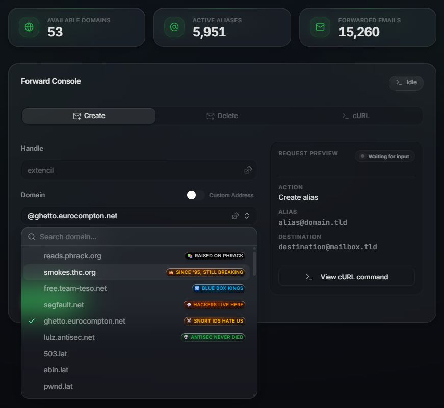
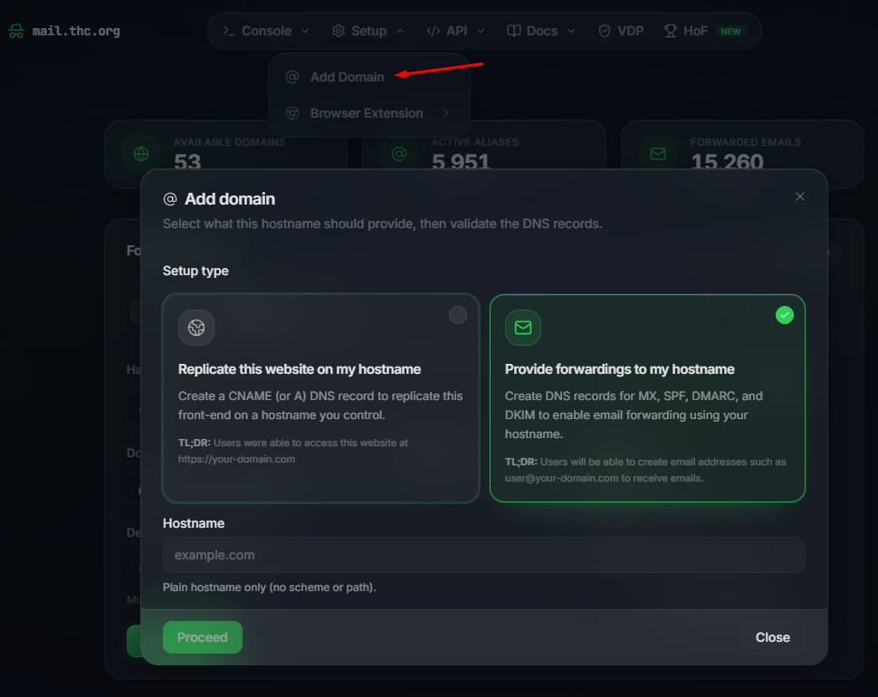

<nav style="height: 25px; margin-top: 0px; margin-bottom: 4rem;">
    <ul style="width: fit-content; padding: 0; margin: 0 auto;">
        <li style="float: left; list-style-image: none; list-style-type: none;">
            <a href="/">Home</a>
        </li>
    </ul>
</nav>

<div style="text-align:center">
    <h1>A Free Email Forwarding Server</h1>
</div>

{:refdef: style="text-align: center;"}
{:height="80%" width="80%"}
{: refdef}

This project allows you to set up an email forward to any email address of your choosing.

## Setup

Use [https://mail.thc.org/](https://mail.thc.org/) (recommended)

Or, try the OG mode: 
This will forward any email to `foobar@segfault.net` to `hackbart@tuta.io`:

```shell
curl 'https://mail.thc.org/api/forward/subscribe?name=foobar&to=hackbart@tuta.io'
```

## Available domains

1. @segfault.net
2. @smokes.thc.org
3. @free.team-teso.net
4. @hackerschoice.org
5. @reads.phrack.org
6. @ghetto.eurocompton.net
7. @lulz.antisec.net
8. @metasploit.io
6. and many more;

See all available domains:
```shell
curl -sS https://mail.thc.org/api/domains | jq -r '.[]'
```

## Browsers extensions and other integrations

* Mozilla Firefox Extension <https://addons.mozilla.org/en-US/firefox/addon/email-alias-manager/> 
* Google Chrome Extension <https://chromewebstore.google.com/detail/email-alias-manager-free/ihjojmdobbcanaafcgpmagmmoaoflpjl> 
* Telegram Bot <https://t.me/thcmail_bot> 
* Discord App <https://discord.com/oauth2/authorize?client_id=1469840254562468013> 
* Discord Bot, user install <https://discord.com/oauth2/authorize?client_id=1469840254562468013&integration_type=1&scope=applications.commands> 
* Discord Bot, guild install <https://discord.com/oauth2/authorize?client_id=1469840254562468013&integration_type=0&scope=applications.commands> 

## Use your own domain

You can use your own domain as well! Follow this:

{:refdef: style="text-align: center;"}
{:height="80%" width="80%"}
{: refdef}

## Why

Because we can. This project is maintained by [Extencil](extencil@proton.thc.org).

TALK TO US IF YOU LIKE TO SEE ANY SPECIFIC FEATURES.

## References

* Console: [https://mail.thc.org/console](https://mail.thc.org/console)
* Console (handles): [https://mail.thc.org/handle](https://mail.thc.org/handle)
* API Docs: [https://mail.thc.org/docs/](https://mail.thc.org/docs/)
* Source code: [https://github.com/haltman-io/mail-forwarding](https://github.com/haltman-io/mail-forwarding)

## Contact

