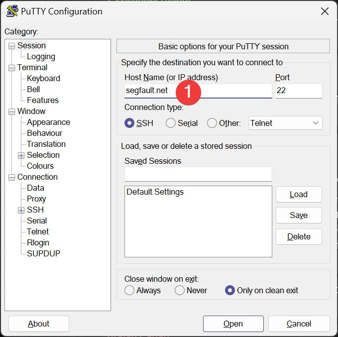
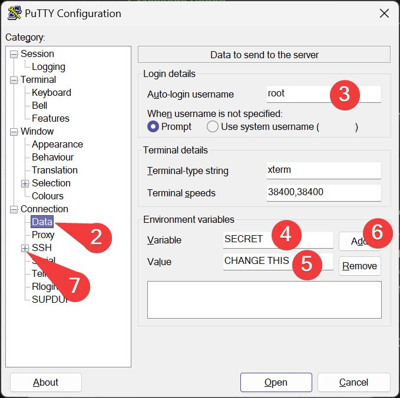
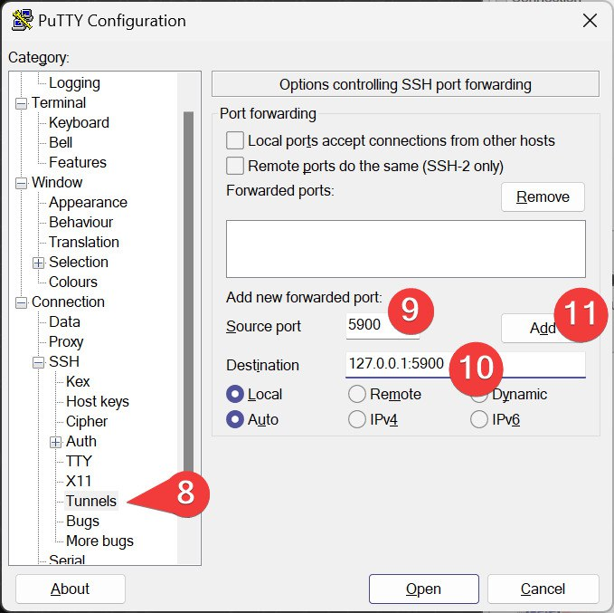

<!-- 
<h1>Putty</h1>
 -->

<!-- 

 -->

Here is how to configure PuTTY for using it with Segfault:

Change your `SECRET` (step 5) and click `Add` (step 6)

> Thanks to __Matthew__ for the screenshots!

## Contact


