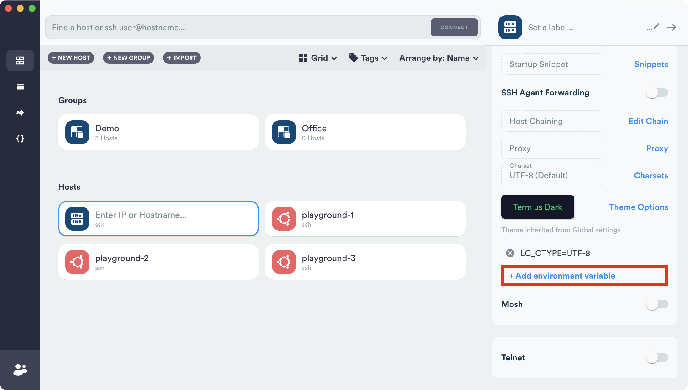
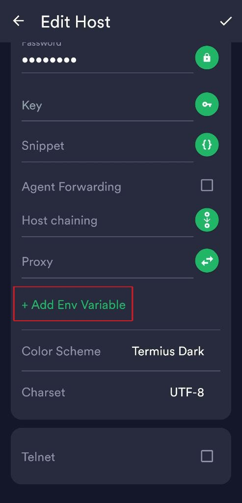

<!-- 
<h1>Termius</h1>
 -->

<!-- 

 -->

Here is how to configure Termius for using it with Segfault:

* __Free users (means no account)__

    Connect to `secret@teso.segfault.net` and enter your secret there.

    > It's not possible to set environment variable without creating a paid or trial account.

* __For paid or registered users__

    

    > Desktop

    

    > Mobile

Thanks to __Matthew__ and __BelievePrime__ for the instructions and screenshots!

> __Note:__ _Cloud sync might be enabled by default_, if you want to disable it, just do the following:
>
> __Settings__ -> __Account Settings__ -> __Sync keys and identities__
>
> _Let us know if these instructions needs to be completed._

## Contact


