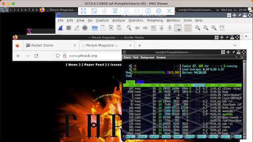

<div style="text-align:center"><h1>Graphical User Interface</h1></div>

<div style="width:80%; margin:auto">
</div>

Use Firefox, Brave, Wireshark, Sublime, Geany and any of your favourite applications on a remote desktop.

{:refdef: style="text-align: center;"}
{:height="80%" width="80%"}
{: refdef}

---

There are a few ways to access a GUI.

### GUI via VNC

Log in to your [root server](../) and type:
```shell
startvnc
```

Thereafter use your favourite VNC Client and connect to `127.0.0.1:5900`.

### GUI via Web

Log in to your [root server](../) and type:
```shell
startxpra
```

Thereafter use your Web Browser and go to http://127.0.0.1:2000.

### GUI via XPRA

Install [XPRA](https://xpra.org/) on your workstation (not server).

```shell
xpra start ssh://root@FluffyBunny/ --exit-with-client=yes --start='xterm -bg black -fg gray' --resize-display=1280x1024 --ssh=ssh --ssh-upgrade=no
```

(replace `FluffyBunny` with the name of your [root server](../))

### IT'S SHIT

Some applications won't work. Chances are that your server does not have enough memory. Be a badass and [buy an upgrade](../buy-an-upgrade) to make all applications work flawlessly.

### Contact

~~Twitter: [https://twitter.com/hackerschoice](https://twitter.com/hackerschoice)~~  
Mastodon: [@thc@infosec.exchange](https://infosec.exchange/@thc)  
Telegram: [https://t.me/thcorg](https://t.me/thcorg)  
Web: [https://www.thc.org](https://www.thc.org)  
Medium: [https://medium.com/@hackerschoice](https://medium.com/@hackerschoice)  
E-Mail: members@thc.org  
