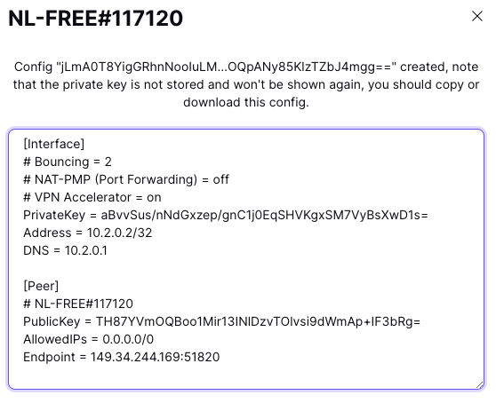

<!-- Begin of ugly CSS navigation styling hack -->
<style>a[href$="/wireguard/"] { font-weight: bold; }</style>
<!-- End of ugly CSS navigation styling hack -->



<div style="text-align:center">
    <h1>Custom WireGuard Exit Nodes</h1>
    <p>Configure your Root Server to send all traffic via an <I>Exit Node</I></p>
</div>

---
Use either `SERVER-MODE` or `CLIENT-MODE` --- but not both.

A new network interface (wgExit) will magically appear on your [Root Server](../): Traffic from your [Root Server](../) will now appear as if originating from the *Exit Node*.

The *Exit Node* can be behind a Firewall or NAT-Gateway (e.g. you can use your workstation as an *Exit Node*). Superuser privileges or root access is not needed.

---
<div style="text-align:center">
<h1>Server-Mode<BR>
Connect from an EXIT NODE to SEGFAULT</h1>
</div>

Typical use case:  
1. You like to [mass-scan](../faq/#scan) from your [Root Server](../).
1. You have shell access to the *Exit Node* and like all traffic from your [Root Server](../) to leave via this *Exit Node*.
1. The *Exit Node* is not reachable from the Internet or is behind NAT/Firewall.
1. You like to connect from your [Root Server](../) to workstations on a remote firewalled/private LAN (e.g. use nmap, metasploit, smbscan, etc.. on your [Root Server](../) to scan a private LAN behind the *Exit Node*).

## Step #1 - On your Root Server

Create and activate an Exit Node configuration:

```shell
curl http://sf/net/up
```

{:refdef: style="text-align: center;"}
{:height="80%" width="80%"}
{: refdef}

Your [Root Server](../) is now ready to accept an Exit Node.

## Step #2 - On the Exit Node

Cut & paste the output from above into the shell on your Exit Node:
{:refdef: style="text-align: center;"}
{:height="80%" width="80%"}
{: refdef}

**>> All traffic from your Root Server will now leave via the Exit Node <<**

---
<div style="text-align:center">
<h1>Client-Mode<BR>
Connect from SEGFAULT to an EXIT NODE</h1>
</div>

Typical use case:  
1. The *Exit Node* is on the public Internet (ProtonVPN, Mullvad, NordVPN, ...)
1. You like to access an [AWS VPC](https://www.procustodibus.com/blog/2021/02/wireguard-with-aws-private-subnets/)/[Private-Subnet](https://docs.aws.amazon.com/vpc/latest/userguide/vpc-example-private-subnets-nat.html)

## On your Root Server

This example uses [Proton's Free VPN](https://account.protonvpn.com/signup?plan=free) as an *Exit Node*. After
[registration](https://account.protonvpn.com/signup?plan=free) scroll down to "WireGuard Configuration" and select "GNU/Linux" and click "Create".

A window containing Proton's WireGuard configuration similar to this one will show:

{:refdef: style="text-align: center;"}
{:height="50%" width="50%"}
{: refdef}

Use this informationon your [Root Server](../):

```shell
curl sf/wg/up -d name=ProtonFree \
              -d PrivateKey=aBvvSus/nNdGxzep/gnC1j0EqSHVKgxSM7VyBsXwD1s= \
              -d Address=10.2.0.2/32 \
              -d PublicKey=TH87YVmOQBoo1Mir13INlDzvTOlvsi9dWmAp+IF3bRg= \
              -d Endpoint=149.34.244.169:51820
```

**>> All traffic from your Root Server will now leave via Proton's Free VPN <<**

---
## More Shenanigans

Each command is executed on the [Root Server](../) (after the Exit Node has connected).

__Check Exit Node__

```
curl sf/net/show  # Server Mode
curl sf/wg/show   # Client Mode
```

__Masscan the Internet__

```
### Simple
masscan -e wgExit -p 22,80,443 --range 1.0.0.0-8.255.255.255
### With banner grabbing:
masscan -e wgExit -p 22,80,443 --range 1.0.0.0-8.255.255.255 --banners --adapter-ip 172.16.0.3-172.16.128.2 --adapter-port 1024-33791
```

__Ping an IPv6 host__

```
ping6 2606:4700:4700::64
```

__Scan the remote private LAN__

```
nmap -n -Pn -sV -F -T5 --min-rate 10000 --open 192.168.123.0/24
```

__Crackmapexec the LAN__

```
cme smb 192.168.123.0/24
```

__Find Window shares on the LAN__

```
nbtscan 192.168.123.0/24
```

__SNMP dump__

```
snmp-check 192.168.123.250
```

__Log in to a workstation (Remote Desktop/RDP) on the LAN__

```
startxweb
remmina -c rdp://username@server
```

__Poke [the lion](police-cars-police-chase.gif) and appear as if originating from the LAN__

```
amass enum -d nsa.gov
```

<!-- __...and other [Hacks, Tips and Tricks](tricks.html).__ -->

## Windows

Cut & Paste the YELLOW strings into an Admin Powershell (Right-Click on Powershell -> _Run as Administrator_) or else Defender's heuristic will block Wiretap. 

## Similar services

1. [WireGuard over Cloudflared](https://iq.thc.org/wireguard-into-a-private-lan-via-cloudflare-tunnels)
1. [Anything over Cloudflared Free](https://iq.thc.org/tunnel-via-cloudflare-to-any-tcp-service)
1. [Tailscale](https://tailscale.com/)
1. [Gsocket](https://www.gsocket.io)

## Contact


