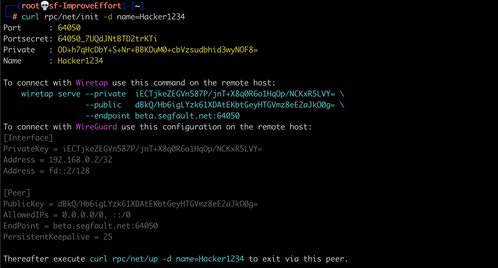

<div style="text-align:center"><h1>WireGuard Reverse Connection</h1></div>

<div style="width:80%; margin:auto">
Configure your Root Server to send all traffic via another server you own.
</div>
  
---
A typical use case is where you like to access a private LAN from Segfault's root server (e.g. with nmap, metasploit, smbscan, ...).

Another often used scenario is to route all port scanning activities via your own *Exit Node*.

The setup uses a *reverse connection* and the *Exit Node* can be behind a firewalled NAT gateway. The *Exit Node* can be Linux, Windows or OSX and no superuser privileges are needed.

---
### On your root server

Create a WireGuard keypair and allocate a UDP Port to your Root Server:
```shell
curl rpc/net/init -d name=NameOfExit
```
Write down the Wiretap or Wireguard configuration.
{:refdef: style="text-align: center;"}
{:height="80%" width="80%"}
{: refdef}


Bring up the Interface:
```shell
curl rpc/net/up -d name=NameOfExit
ip addr show
```

### On the Exit Node

Use either Wiretap or WireGuard.

1. Wiretap:  
Install the pre-compiled single [Wiretap binary](https://github.com/sandialabs/wiretap/releases/tag/v0.1.0) for Linux, Windows or OSX. Execute the Wiretap command as shown in the output from your *curl rpc/net/init* command.

1. WireGuard:  
Install & configure [WireGuard](https://www.wireguard.com/)


On your root server check the connection:
```shell
curl rpc/net/show
```

### Pro Tip

It is possible to install Wiretap on many many servers and only activate the Interface on Segfault if and when needed. 

Step #1: Allocate a UDP port on Segfault.
```shell
curl rpc/net/init
```
Take a note of the *port*. Ignore the rest of the output.

Step #2: Generate Keys on the Exit Node.
```shell
wiretap configure -e beta.segfault.net:<port> # Replace 'beta' with the segfault region you are using
```

Take note of the *PrivateKey* (Private1) and the *--private* key (Private2).
{:refdef: style="text-align: center;"}
{:height="80%" width="80%"}
{: refdef}

Step 3: Start wiretap

```shell
wiretap serve --private <Private2> --public <...> --endpoint beta.segfault.net:<port>
```

Repeat Step #3 on other Exit Nodes.

Step #4: Access the Network

On your Root Server:
```
curl rpc/net/up -d name=Hacker3133 -d private=<Private1> -d peer_private=<Private2>
```


### Contact

~~Twitter: [https://twitter.com/hackerschoice](https://twitter.com/hackerschoice)~~  
Mastodon: [@thc@infosec.exchange](https://infosec.exchange/@thc)  
Telegram: [https://t.me/thcorg](https://t.me/thcorg)  
Web: [https://www.thc.org](https://www.thc.org)  
Medium: [https://medium.com/@hackerschoice](https://medium.com/@hackerschoice)  
E-Mail: members@thc.org  
