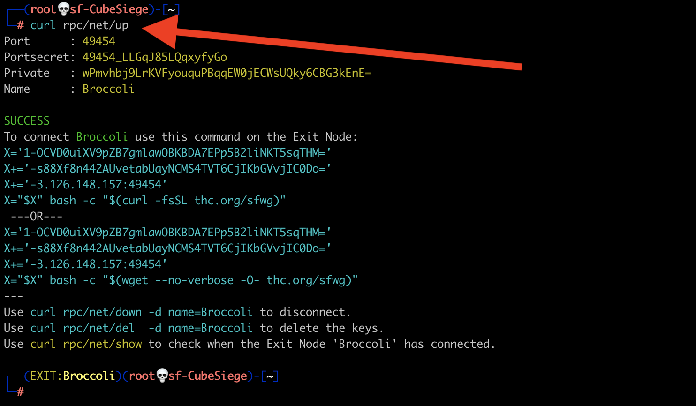
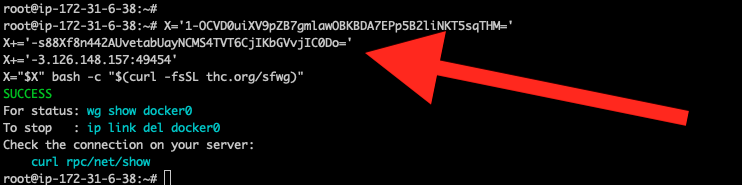

<div style="text-align:center">
    <h1>Custom WireGuard Exit Nodes</h1>
    <p>Configure your Root Server to send all traffic via another server you own</p>
</div>

---
Typical use cases:
1. You like to [mass-scan](../faq/#scan) from your [Root Server](../).
1. You have access to a server (*Exit Node*) and like all traffic from your [Root Server](../) to be routed via your *Exit Node*.
1. You like to connect from your [Root Server](../) to workstations on a remote firewalled/private LAN (e.g. use nmap, metasploit, smbscan, on your [Root Server](../) to scan the private LAN...).
1. You like all your traffic from your [Root Server](../) to appear as if originating from your *Exit Node* (a server you own).

A new network interface (wgExit) will magically appear on your [Root Server](../): Traffic from your [Root Server](../) will now leave via the *Exit Node*.

The *Exit Node* can be behind a firewalled NAT gateway (like your workstation is) or any other host on the Internet. Superuser privileges or root access is not needed.

---

## Step #1 - On your Root Server

Create and activate an Exit Node configuration:

```shell
curl http://rpc/net/up
```

{:refdef: style="text-align: center;"}
{:height="80%" width="80%"}
{: refdef}

Your [Root Server](../) is now ready to accept an Exit Node.

## Step #2 - On the Exit Node

Cut & paste the output from above into the shell on your Exit Node:
{:refdef: style="text-align: center;"}
{:height="80%" width="80%"}
{: refdef}

**>> All traffic from your Root Server will now leave via the Exit Node <<**

## More Shenanigans

Each command is executed on the [Root Server](../) (after the Exit Node has connected).

__Check Exit Node__

```
curl http://rpc/net/show
```

__Masscan the Internet__

```
### Simple
masscan -e wgExit -p 22,80,443 --range 1.0.0.0-8.255.255.255
### With banner grabbing:
masscan -e wgExit -p 22,80,443 --range 1.0.0.0-8.255.255.255 --banners --adapter-ip 172.16.0.3-172.16.128.2 --adapter-port 1024-33791
```

__Ping an IPv6 host__

```
ping6 2606:4700:4700::64
```

__Scan the remote private LAN__

```
nmap -n -Pn -sV -F -T5 --min-rate 10000 --open 192.168.123.0/24
```

__Crackmapexec the LAN__

```
cme smb 192.168.123.0/24
```

__Find Window shares on the LAN__

```
nbtscan 192.168.123.0/24
```

__SNMP dump__

```
snmp-check 192.168.123.250
```

__Log in to a workstation (Remote Desktop/RDP) on the LAN__

```
startxweb
remmina -c rdp://username@server
```

__Poke [the lion](police-cars-police-chase.gif) and appear as if originating from the LAN__

```
amass enum -d nsa.gov
```

<!-- __...and other [Hacks, Tips and Tricks](tricks.html).__ -->

## Windows

Cut & Paste the YELLOW strings into an Admin Powershell (Right-Click on Powershell -> _Run as Administrator_) or else Defender's heuristic will block Wiretap. 

## Contact


