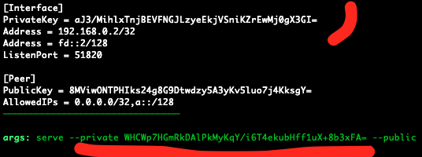

<div style="text-align:center"><h1>WireGuard Reverse Connection</h1>  
Hacks, Tips, Tricks and other shenanigans</div>

### Misc Tips

1. Try `curl rpc/net/help` for some help
1. `-d name=all` works with all commands
1. `curl rpc/net/show` may show that the interface is up but that no data has been transfered. It is likely that you have not started `wiretap` on the Exit Node yet or that Wiretap can not reach your Root Server.
1. It is only possible to have 1 Interface up at a time. (if you like us to add multi-interface support then please contact us.)

### Deploy Wiretap first

It is possible to install [Wiretap](https://github.com/sandialabs/wiretap) on many many servers and only activate the Interface on your [Root Server](../) if and when needed. Think about it as a *__reverse connect back__* access to a remote private LAN.  

A deployed Wiretap will connect back to your [Root Server](../) indefinitely and until is removed from the remote private LAN. This is regardless of how often you activate or de-active the interface on your [Root Server](../).

__Step #1: Allocate a UDP port on your Root Server__
```shell
curl rpc/net/init
```
Take note of the *port*. The UDP Port is now associated with your [Root Server](../). Ignore the rest.

__Step #2: Generate Keys on the Exit Node__

The Exit Node is any Linux, Windows or OSX system inside the remote private LAN.
```shell
wiretap configure -e beta.segfault.net:<port> # Replace 'beta' with the segfault region you are using
```

Take note of the *PrivateKey* (Private1) and the *--private* key (Private2).
{:refdef: style="text-align: center;"}
{:height="80%" width="80%"}
{: refdef}

__Step 3: Start wiretap on the Exit Node__

```shell
wiretap serve --private <Private2> --public <...> --endpoint beta.segfault.net:<port>
```

Repeat Step #2 and #3 on other Exit Nodes.

__Step #4: Access the Network__

On your [Root Server](../):
```
curl rpc/net/up -d name=PrivLAN31337 -d private=<Private1> -d exit_private=<Private2>
```


### Contact

~~Twitter: [https://twitter.com/hackerschoice](https://twitter.com/hackerschoice)~~  
Mastodon: [@thc@infosec.exchange](https://infosec.exchange/@thc)  
Telegram: [https://t.me/thcorg](https://t.me/thcorg)  
Web: [https://www.thc.org](https://www.thc.org)  
Medium: [https://medium.com/@hackerschoice](https://medium.com/@hackerschoice)  
E-Mail: members@thc.org  
