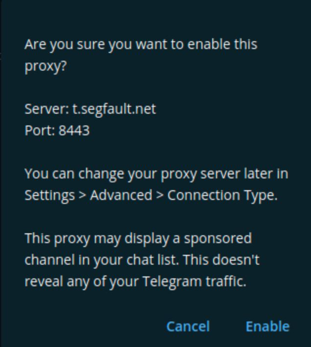

## Setup

Simply click on the following link to use the Proxy:

{:refdef: style="text-align: center;"}
[https://t.me/proxy?server=t.segfault.net&port=8443&secret=bcfb182a1bafbc16ea92652628133c07](https://t.me/proxy?server=t.segfault.net&port=8443&secret=bcfb182a1bafbc16ea92652628133c07)
{: refdef}

Telegram will start upon clicking the link. Press ```Enable``` to accept the Proxy.

{:refdef: style="text-align: center;"}
{:height="50%" width="50%"}
{: refdef}

## Why

Because we can. This project is maintained by [LouCipher](https://t.me/thcorg).

THIS IS BETA TESTING AT THE MOMENT. TALK TO US IF YOU LIKE TO SEE ANY SPECIFIC FEATURES.

## Contact


